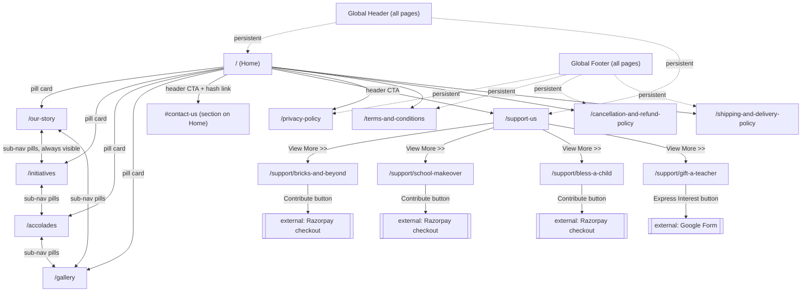

# H. H. High School — Website Modernization Plan

Source of truth for content/behavior: the live Framer site **https://hhhighschool.org/** (final realization).
The Figma file (`Wop2dMoF6Op9jYB2GXRPXv`) is the earlier component concept — Framer is what we are rebuilding, in Next.js + shadcn/ui.

This is a from-scratch rebuild, not a byte-for-byte scrape: same pages, same navigation, same content, same visual language and color system, same interaction *intent* — implemented with a modern component architecture, real accessibility, and a few tasteful motion upgrades called out explicitly below so it's clear what's "faithful clone" vs. "deliberate improvement."

## 1. Recon summary (what the live site actually is)

The site is **not** a deep multi-level site — it's a small marketing/non-profit site: one long-scroll homepage + a 4-tab "story cluster" of sub-pages + a donation flow + legal boilerplate. Total: **14 routes**.

Confirmed via live DOM inspection (fonts, computed colors, link graph, scroll/click sweep):

- **Headline font:** `Anton` (Google Font) — bold condensed display, used for every heading/nav label, uppercase.
- **Body font:** `Inter` (Google Font) — used for all paragraph copy.
- **Brand color system** (exact `getComputedStyle` values), one color per "pillar":
  | Token | Hex | RGB | Used for |
  |---|---|---|---|
  | `--brand-story` (teal) | `#38C4C1` | 56,196,193 | "Our Story" pill, story accents |
  | `--brand-initiatives` (yellow) | `#FECA02` | 254,202,2 | "Initiatives" pill, initiative cards |
  | `--brand-accolades` (pink) | `#FE7EC9` | 254,126,201 | "Accolades" pill, award cards |
  | `--brand-gallery` (blue) | `#488DF4` | 72,141,244 | "Gallery" pill, gallery accents |
  | `--brand-cta` (green) | `#4ACA03` | 74,202,3 | "Contribute" button, primary CTAs |
  | `--brand-sky` (light cyan) | `#99EEFF` | 153,238,255 | decorative accent |
  | `--surface-muted` | `#F7F7F7` | 247,247,247 | section backgrounds |

  These four pillar colors are the entire visual identity — they recur as card backgrounds, underlines, and button accents across every page. They map to shadcn CSS variables as `--chart-1..4` plus custom `--brand-*` tokens (not `primary`, since there are four equally-weighted brand colors, not one).

- **No hamburger/mobile nav found in DOM** — the header nav is only 2 text links (`HOME`, `CONTACT US`) + socials + one CTA button, so it never needs to collapse; it just wraps/shrinks. We'll still add a `Sheet`-based mobile menu since our final content-per-page is heavier than the original and a11y benefits from it — noted as a deliberate improvement.

## 2. Full site map & navigation graph



**Navigation rules that must be preserved:**
1. The global header (`HOME`, `CONTACT US`, social icons, `CONTRIBUTE` button) appears on **every** route, including legal pages.
2. `/our-story`, `/initiatives`, `/accolades`, `/gallery` share a second-level nav: **4 fixed-color pill tabs**, always all 4 visible and always the same colors, regardless of which one is "active" (there is no active-state styling on the live site — we will add a subtle active-state underline/scale as an accessibility improvement, since "no indication of current page" is a real usability gap worth fixing).
3. `CONTACT US` in the header is a **hash link to `/#contact-us`** — there is no dedicated contact page. If clicked from a sub-page, it must navigate to `/` and then scroll to the section.
4. `CONTRIBUTE` (header) and `Contribute` (footer quick link) both point to `/support-us`.
5. `/support-us` cards deep-link to their own detail route (`/support/<slug>`) via "View More >>", and separately trigger an **external** checkout (Razorpay) or Google Form via the primary CTA button — these must open in a new tab (`target="_blank" rel="noopener noreferrer"`) since they leave the site.
6. Footer quick links duplicate the primary nav + legal pages, present on every route.

## 3. Route inventory & content model

| # | Route | Purpose | Key content blocks |
|---|---|---|---|
| 1 | `/` | Home / long-scroll landing | Hero, 4 pillar cards, Director's Message, Principal's Note, Volunteer testimonials, Vision/Mission, Gratitude & Impressions (avatar carousel), "Let Us Celebrate Efforts" video, Scholarships carousel, Alumni testimonials, Contact info cards (`#contact-us`), Footer |
| 2 | `/our-story` | Founding narrative | Sub-nav, title, narrative copy blocks each paired with an optional portrait + caption (Hamid Hassan, Habiba Hassan, founders, supporters) |
| 3 | `/initiatives` | Programs run by the school | Sub-nav, title, 3-col grid of 9 initiative cards (image, title, subtitle, description) — REACH2teach, LIVE Classroom, VOLUNTEER2teach, VOLUNTEER2teach Global, Echoes of Experience, Happy Periods, Share Your Laptop, Wonder Over Web (WOW), Bless a Child |
| 4 | `/accolades` | Press & recognition | Sub-nav, title, 2-col grid of ~14 award/media cards (image, title, description, "Watch Video" or "View more" link) |
| 5 | `/gallery` | Photo archive | Sub-nav, title, 7 categorized image sections (In the Media, Health & Wellbeing, Visit & Guest Interactions, Events & Celebrations, Student Creativity, Community Engagement, Powered by People) — ~47 images total, click-to-enlarge lightbox |
| 6 | `/support-us` | Donation hub | Hero, 3 "why give" info cards, 4 "ways to give" cards (Bricks and Beyond, School Makeover, Bless a Child, Gift a Teacher) each linking to a detail page + external payment/form |
| 7 | `/support/bricks-and-beyond` | Give detail: infrastructure | Shared hero, Why We Need Your Help / Our Support Plan / How You Can Help, external Contribute CTA |
| 8 | `/support/school-makeover` | Give detail: classroom revamp | same template as above |
| 9 | `/support/bless-a-child` | Give detail: sponsor a student | same template as above |
| 10 | `/support/gift-a-teacher` | Give detail: fund a teacher salary | same template, CTA is "Express Interest" → Google Form |
| 11 | `/privacy-policy` | Legal | Prose sections |
| 12 | `/terms-and-conditions` | Legal | Prose sections |
| 13 | `/cancellation-and-refund-policy` | Legal | Prose sections (donation refund terms) |
| 14 | `/shipping-and-delivery-policy` | Legal | Prose (India payment-gateway compliance boilerplate — required by Razorpay for any org accepting online payments, even with no physical shipping) |

All four `/support/*` detail pages and all four legal pages are **data-driven from one template component each** (`SupportDetailTemplate`, `LegalPageTemplate`) — four nearly-identical pages is a sign to parametrize, not hand-roll four times.

## 4. Subtle interactions & motion (explicit, per section)

This is the part most rebuilds skip. Every behavior below was confirmed by scrolling/clicking/waiting on the live site rather than guessed from a screenshot.

| Element | Interaction model | Detail |
|---|---|---|
| Global header | Static (no scroll-shrink observed on live site) | **Deliberate upgrade:** add a subtle `shadow-sm` + backdrop-blur once `scrollY > 8px`, via a small `useScrollHeader` hook. Cheap, expected modern-site polish, doesn't fight the source. |
| Hero CTA "Watch Our Story!" | Click | Live site opens YouTube in a new tab. **Deliberate upgrade:** open in a `Dialog` (shadcn) with a lazy-mounted `<iframe>` — keeps the visitor on-site, avoids autoplay-in-new-tab jank. Escape/backdrop click closes it; video unmounts on close (no audio bleed). |
| 4 pillar cards (Home) | Hover | Live site: flat color blocks, no visible hover treatment. Add `hover:brightness-110 hover:-translate-y-0.5 transition` — subtle, consistent with the rest of the redesign's card language. |
| Sub-nav 4-pill tabs | Static, always 4 colors, no active state on live site | Add active-route detection (`usePathname`) → active pill gets a small bottom indicator bar + `aria-current="page"`. This is an accessibility fix, not a visual reinvention. |
| Volunteer / Alumni testimonial rows | **Confirmed scroll-driven, not click, not autoplay** (verified: waited 2s, no movement; cards are simply wider than viewport) | Implement as a native horizontally-scrolling row with `scroll-snap-type: x mandatory` + `overscroll-behavior-x: contain`, drag-to-scroll on desktop via pointer events (`cursor: grab`), and — since we already ship the shadcn `Carousel` (Embla) for the Scholarships section — reuse it here too for keyboard/swipe support the original lacks. |
| Vision / Mission section | Center image pops in after a beat (observed blank → loaded) | This is a lazy-load artifact, not an animation. Reproduce intentionally: `next/image` with a blur placeholder, plus a `fade-in` on load (`framer-motion` `initial={{opacity:0}} animate={{opacity:1}}`) so the "pop in" reads as designed rather than as a loading glitch. |
| "Scholarships Offered" | **Confirmed click-driven carousel** — explicit prev/next circular arrow buttons, one slide per scholarship (e.g. "Bandana Bose Gold Medal Award") | shadcn `Carousel` (Embla-based), one slide per scholarship, arrows styled to match the on-brand circular button already seen on the live site. No autoplay (matches source). |
| "Let Us Celebrate Efforts" video | Static embed | Plain responsive `AspectRatio` + lazy-loaded YouTube iframe (`loading="lazy"`, `youtube-nocookie.com`). |
| Gallery images | Not confirmed on live site (no lightbox detected in the time available) | **Deliberate addition:** click any image → shadcn `Dialog` lightbox with prev/next within that category. Flagged explicitly as an addition because a 47-image flat grid with no zoom is a real usability gap on a "gallery" page. |
| Support-us "ways to give" cards | Hover | Flat color band under image on live site, no hover feedback observed. Add `hover:shadow-lg hover:-translate-y-1 transition-transform` to match pillar-card treatment. |
| "Contribute" / "Express Interest" buttons | Click → external | Must visually signal "leaves the site" (small `↗` icon) since it's a payment gateway or a Google Form — a modernization/trust affordance, not decoration. |
| All above-the-fold sections down the homepage | Not present on live site | **Deliberate addition:** scroll-reveal (`fade + translate-y-4`, `framer-motion` `whileInView`, `viewport={{ once: true, margin: "-80px" }}`) on each major section. Standard for this genre of storytelling site, cheap to do consistently, easy to rip out if the client doesn't want it — implemented as one `<Reveal>` wrapper component, not scattered ad-hoc logic. |
| Route changes | Full reload look on live Framer export | Next.js App Router gives instant client-side nav for free; no added transition library needed — resist adding a page-transition library for its own sake (YAGNI). |

**Explicitly NOT reproduced:** any Framer-specific runtime behavior we couldn't observe within the recon window (e.g., undiscovered hover states on individual award/media cards) — these default to the same restrained `hover:shadow` treatment used elsewhere for consistency, rather than being guessed at per-component.

## 5. Tech stack

- **Next.js 15** (App Router, TypeScript, `src/` dir) — file-based routing matches our 14-route map almost 1:1.
- **Tailwind CSS v4** + **shadcn/ui** — component primitives: `Button`, `Card`, `Dialog`, `Carousel` (Embla), `Sheet` (mobile nav), `NavigationMenu`, `AspectRatio`, `Skeleton`, `Badge`, `Separator`, `Accordion` (support-detail FAQs if needed).
- **`next/font/google`** for `Anton` + `Inter` — no external font requests, no CLS.
- **`next/image`** for every photo (47 gallery images, portraits, card images) — automatic optimization/lazy-loading, `sizes` tuned per grid.
- **`framer-motion`** — the *only* added interaction library — powers `<Reveal>` scroll-in and the Vision/Mission fade. Not used for page transitions (YAGNI).
- **`embla-carousel-react`** — pulled in transitively by shadcn's `Carousel`; reused for Scholarships + testimonial rows instead of hand-rolling a second carousel implementation.
- **`lucide-react`** — icon set already standard with shadcn (map pin, phone, mail, external-link, chevrons, play).
- **No CMS, no database, no auth, no form backend.** The live site has no on-site form (the only "form-like" thing is an external Google Form link) and no login. Adding any of that would be scope creep. Content lives in typed local data files (see §6) — swappable for a CMS later if the client ever asks, but YAGNI today.
- **Deployment target:** Vercel-compatible static/ISR build (`next build`); we will verify the build passes locally but won't perform an actual deploy without the user's Vercel access.

## 6. Content architecture

```
src/
  app/
    layout.tsx                 # <html>, fonts, <Header/>, <Footer/>, metadata
    page.tsx                   # Home
    our-story/page.tsx
    initiatives/page.tsx
    accolades/page.tsx
    gallery/page.tsx
    support-us/page.tsx
    support/[slug]/page.tsx    # 4 detail pages, generateStaticParams from data
    privacy-policy/page.tsx
    terms-and-conditions/page.tsx
    cancellation-and-refund-policy/page.tsx
    shipping-and-delivery-policy/page.tsx
    globals.css                # brand tokens, shadcn tokens, base styles
  components/
    layout/Header.tsx          # nav + mobile Sheet + scroll shadow
    layout/Footer.tsx
    layout/SubNavPills.tsx      # 4-pill sub-nav, active-state aware
    layout/Reveal.tsx           # framer-motion scroll-in wrapper
    home/Hero.tsx
    home/PillarCards.tsx
    home/DirectorMessage.tsx
    home/TestimonialRow.tsx     # reused for volunteers + alumni (data-driven)
    home/VisionMission.tsx
    home/ScholarshipsCarousel.tsx
    home/ContactCards.tsx
    initiatives/InitiativeCard.tsx
    accolades/AccoladeCard.tsx
    gallery/GallerySection.tsx
    gallery/Lightbox.tsx
    support/ProgramCard.tsx
    support/SupportDetailTemplate.tsx
    legal/LegalPageTemplate.tsx
    ui/...                      # shadcn generated components
  content/
    site.ts                    # nav items, socials, address/phone/email, brand colors
    initiatives.ts
    accolades.ts
    gallery.ts
    supportPrograms.ts          # also backs generateStaticParams for /support/[slug]
    testimonials.ts             # volunteers
    alumni.ts
    scholarships.ts
    storyContent.ts
  lib/
    utils.ts                   # cn() etc. (shadcn default)
public/
  images/...                   # downloaded, real site imagery (portraits, initiative photos, award photos, gallery categories, support-us photos)
  favicon.ico, og.png
```

Every page component receives its content as typed props from `content/*.ts` — no copy hardcoded inline in JSX. This is what makes the four support-detail pages and four legal pages one template each instead of four hand-written pages each.

## 7. Build sequence (step-by-step)

Sequential where it must be (foundation), otherwise each numbered step is a shippable, buildable increment.

1. **Scaffold**: `create-next-app` (TS, Tailwind, App Router, `src/` dir, ESLint) → init shadcn (`components.json`) → add the component set listed in §5.
2. **Foundation**: fonts in `layout.tsx`, brand tokens + shadcn tokens in `globals.css`, `content/site.ts` (nav, socials, address), base `Header` + `Footer` + mobile `Sheet` nav — verify on an empty page.
3. **Download real assets**: script to fetch the real images used across the site (portraits, initiative photos, award photos, gallery categories, support imagery, logo) into `public/images/**`, named by section — real content per clone-website principle #3, not placeholders.
4. **Home page**, section by section: Hero → PillarCards → DirectorMessage/PrincipalNote → TestimonialRow(volunteers) → VisionMission → Gratitude carousel → embedded video → ScholarshipsCarousel → TestimonialRow(alumni) → ContactCards. Each section is its own component; wire into `app/page.tsx` last.
5. **`SubNavPills`** component (shared by the 4 story-cluster pages) — build once, reuse four times.
6. **`/our-story`** — narrative + portraits, using `SubNavPills`.
7. **`/initiatives`** — `InitiativeCard` × 9 in a responsive grid.
8. **`/accolades`** — `AccoladeCard` × ~14 in a responsive grid.
9. **`/gallery`** — `GallerySection` × 7 categories + `Lightbox`.
10. **`/support-us`** — hero, info cards, `ProgramCard` × 4.
11. **`SupportDetailTemplate`** + `/support/[slug]` × 4 via `generateStaticParams`.
12. **`LegalPageTemplate`** + 4 legal routes.
13. **Responsive pass**: verify all pages at 1440 / 768 / 390 — grids collapse to 1–2 cols, header nav wraps into the `Sheet` below `md`, testimonial rows stay horizontally scrollable at every width.
14. **Motion pass**: add `<Reveal>` to homepage sections, confirm `prefers-reduced-motion` disables it (accessibility, not optional).
15. **`next build`** verification + fix any type/build errors; manual click-through of every nav path in §2's graph to confirm no dead links.

## 8. Explicit scope decisions (ponytail-style — said out loud, not silently dropped)

- **Not pixel-measuring every card's `getComputedStyle`.** For a 14-route, ~120-content-item site, doing full per-component CSS extraction (as a single-page pixel-clone workflow would) is disproportionate. We extracted exact fonts, exact brand colors, real copy, and the real page/nav graph — then build with shadcn's own spacing/type scale inside that palette. Result will be faithful in content, structure, and color; not a binary pixel diff of the Framer export.
- **No CMS / no backend** — content is real but static; matches the live site's own lack of a login or dashboard.
- **No payment integration** — "Contribute" buttons link out to the school's real Razorpay links / Google Form, exactly like the source. We do not build a checkout.
- **No dedicated `/contact` page** — the source doesn't have one either; `CONTACT US` is a same-page anchor, preserved as such.
- **Legal pages get real section structure but standard boilerplate prose** — content wasn't fully transcribed during recon; will be written as genuine, reasonable policy text for an Indian education non-profit accepting donations (not fabricated claims/numbers), swappable by the client's own legal counsel later.
- **Gallery lightbox and header scroll-shadow are additions**, called out above — both are cheap, standard, and reversible if unwanted.
